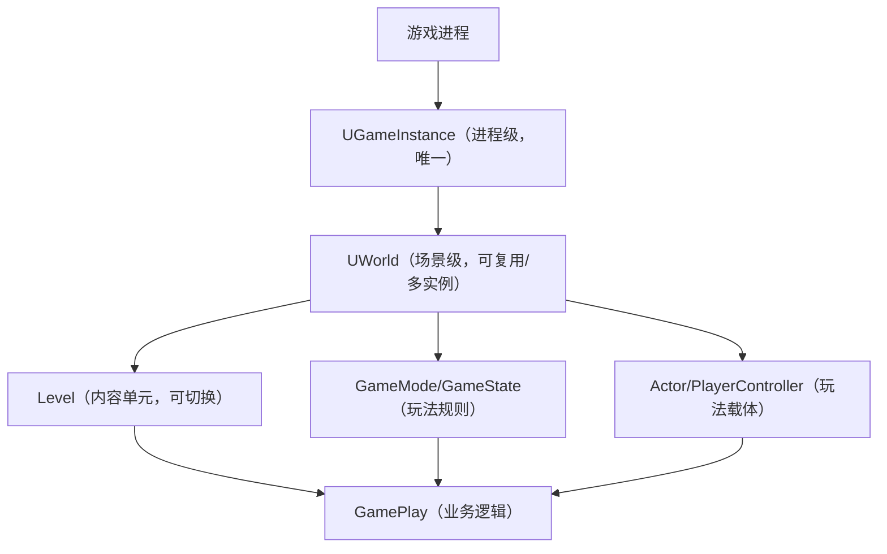

# Unreal Engine 核心架构：World/GameInstance/Level/GamePlay 关系梳理

## 一、核心概念定义

### 1. UGameInstance（游戏实例）

- **本质**：游戏**进程级**的全局根管理器，一个游戏进程从启动到退出只会有**一个 UGameInstance 实例**。

- **核心定位**：「游戏的灵魂」，负责存储跨地图、跨场景的全局数据和资源，管理 UWorld 的创建/销毁/切换。

- **存储内容**：玩家等级/金币、全局配置、网络会话、音效池等需要全程保留的资源。

- **生命周期**：游戏进程启动 → 进程退出（全程唯一，不随地图切换改变）。

### 2. UWorld（世界）

- **本质**：当前游戏场景的**运行环境/沙盒**，是 Actor、Level、GameMode/GameState 等对象的「总容器」。

- **核心定位**：「游戏的肉身」，负责管理当前场景的时间、物理、网络同步、Actor 生命周期。

- **存储内容**：场景内的所有 Actor、Level 数据、GameMode/GameState（场景级状态）、世界设置等。

- **生命周期**：场景加载 → 场景卸载/替换（可复用实例，普通地图切换不重建）。

### 3. Level（关卡/地图）

- **本质**：UWorld 管理的「内容单元」，通常我们说的「地图（.umap 文件）」就是一个「主 Level」。

- **核心定位**：UWorld 中的「具体场景内容」，包含地形、建筑、道具、出生点等静态/动态 Actor。

- **存储内容**：场景的几何数据、Actor 实例、关卡蓝图逻辑等。

- **生命周期**：随 UWorld 加载/卸载，可动态切换（如从主菜单 Level 切换到战斗 Level）。

### 4. GamePlay（游戏玩法）

- **本质**：不是具体的引擎类，而是**基于引擎核心类构建的游戏业务逻辑总称**。

- **核心定位**：开发者基于 UWorld/GameInstance/Level 等引擎底层类，实现的游戏规则、交互逻辑、玩法系统（如战斗、任务、UI 交互等）。

- **载体**：GameMode/GameState（全局玩法规则）、PlayerController/PlayerState（玩家相关玩法）、Actor/Blueprint（场景内玩法）等。

## 二、核心关系层级（从顶层到底层）


### 关键层级说明

1. **UGameInstance 是「上级管理者」**

    - 一个 UGameInstance 可管理多个 UWorld（普通游戏仅用 1 个主 UWorld）；

    - UWorld 的创建、销毁、地图切换（Level 替换）均由 UGameInstance 主导；

    - UGameInstance 存储的全局数据，可被所有 UWorld 访问。

2. **UWorld 是「场景运行容器」**

    - UWorld 是 Level 的「容器」，一个 UWorld 可加载多个 Level（主 Level + 流式加载 Level）；

    - 切换地图 = 在同一个 UWorld 中替换「主 Level」，UWorld 实例本身不销毁；

    - UWorld 是 GamePlay 逻辑的「运行环境」，所有 GamePlay 相关类（Actor/GameMode 等）都依赖 UWorld 存在。

3. **Level 是「场景内容载体」**

    - Level 是 UWorld 中的「具体内容」，无 UWorld 则 Level 无法运行；

    - 多个 Level 可被 UWorld 同时加载（如主 Level + 地形 Level + 道具 Level），实现流式加载。

4. **GamePlay 是「业务逻辑层」**

    - GamePlay 不依赖单一类，而是基于 UWorld/GameInstance/Level 等底层类构建；

    - GamePlay 逻辑的「全局状态」存在 UWorld 的 GameState 中，「跨地图状态」存在 UGameInstance 中，「场景内临时状态」存在 Level 的 Actor 中。

## 三、核心协作流程（游戏启动→切换地图→退出）

### 1. 游戏启动

```Plain Text

游戏进程启动 → 创建 UGameInstance（执行 Init()，初始化全局资源）
→ UGameInstance 创建主 UWorld → UWorld 加载默认 Level（如主菜单）
→ UWorld 初始化 GameMode/GameState → 运行 Level 内的 GamePlay 逻辑（主菜单交互）
```

### 2. 切换地图（主菜单→战斗关卡）

```Plain Text

调用 OpenLevel → UGameInstance 通知主 UWorld 卸载旧 Level
→ UWorld 加载新的战斗 Level → 重新初始化战斗相关 GameMode/GameState
→ UGameInstance 的全局数据（如玩家等级）全程保留 → 运行战斗场景的 GamePlay 逻辑
```

### 3. 退出游戏

```Plain Text

玩家触发退出 → UGameInstance 执行 Shutdown()（清理全局资源）
→ 销毁 UWorld → 退出游戏进程 → UGameInstance 销毁
```

## 四、核心使用原则（开发者视角）

|数据/逻辑类型|推荐存储/实现位置|原因|
|---|---|---|
|跨地图保留的全局数据（金币/等级）|UGameInstance|全程不销毁，切换地图不丢失|
|场景内全局状态（比分/回合数）|UWorld → GameState|随场景重置，支持服务器-客户端同步|
|具体场景内容（地形/道具）|Level|可独立加载/卸载，便于场景管理|
|游戏规则/判定（胜负/重生）|UWorld → GameMode|仅服务器运行，保证逻辑安全|
|玩家交互逻辑（移动/技能）|UWorld → PlayerController|依赖当前场景的运行环境|
## 五、关键总结

1. **层级关系**：UGameInstance（进程级）> UWorld（场景级）> Level（内容级），GamePlay 是基于三者的业务逻辑层；

2. **生命周期**：UGameInstance 全程唯一，UWorld 可复用，Level 可动态切换；

3. **核心区别**：

    - UGameInstance 管「全局不变的资源/数据」；

    - UWorld 管「当前场景的运行环境」；

    - Level 管「当前场景的具体内容」；

    - GamePlay 管「基于以上三者的游戏玩法逻辑」。
> （注：文档部分内容可能由 AI 生成）